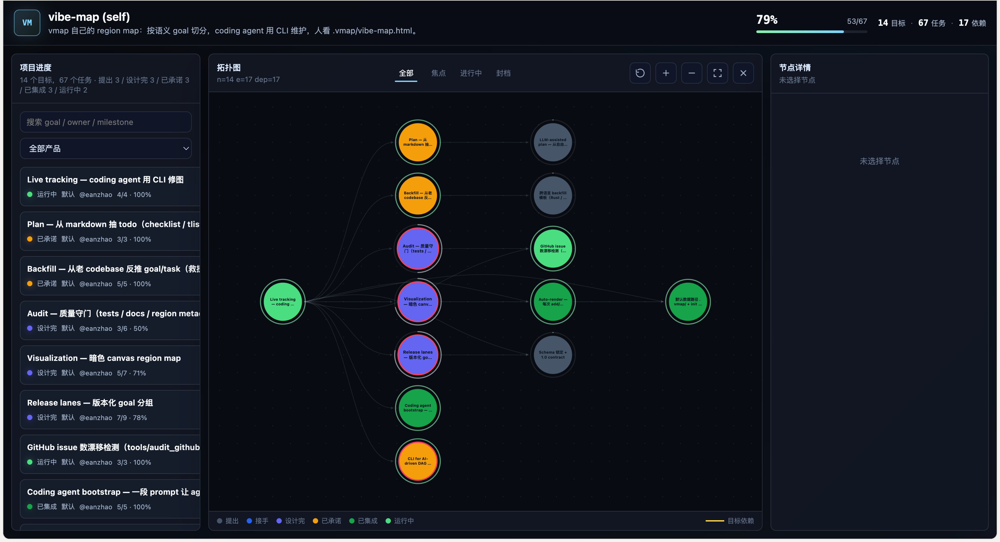

# vibe-map

> Coding agent 用 CLI 修一张 goal DAG，人在 `.vmap/vibe-map.html` 看 region map 风格的实时进展。



> 上图是 vibe-map 自己 dogfood 出来的 self-map（`examples/dag.html` 是 live 版本，本地 `open` 可看）。

## 安装

```bash
# 装最新 release（macOS arm64、Linux x86_64 / arm64）
curl -fsSL https://raw.githubusercontent.com/eanzhao/vibe-map/master/install.sh | bash
```

会把 `vmap` 放到 `~/.local/bin/`，skills 放到 `~/.vmap/skills/`。如果 `~/.local/bin` 不在 `$PATH`，脚本会提示你加。

> Intel Mac (`darwin-x86_64`) 当前不在预编译矩阵里（GitHub Actions macos-13 runner 排队太慢）。Intel mac 用户先 `git clone + moon build` 然后用 `--local` 模式装，见下一段。

**从源码装**（已有 MoonBit 工具链 + 想本地改）：

```bash
git clone https://github.com/eanzhao/vibe-map && cd vibe-map
moon install && moon build --target native --release
./install.sh --local "$PWD"
```

详细分发设计见 [`docs/distribution.md`](docs/distribution.md)。

## 让你的 coding agent 用 vmap

复制下面这一整段，发给 Claude Code / Codex / Cursor / 任何 coding agent，它就会自动装 vmap、读懂工作模式、开始在你项目里维护 DAG：

````text
帮我用 vibe-map（vmap）维护这个项目的进度。

如果还没装 vmap：
  curl -fsSL https://raw.githubusercontent.com/eanzhao/vibe-map/master/install.sh | bash
  # 如果 ~/.local/bin 不在 PATH，按脚本提示加到 ~/.zshrc 然后 source 一下

读懂规则（必读）：
  cat ~/.vmap/skills/SKILL.md
  ls ~/.vmap/skills/playbooks/

在项目根初始化（如果 .vmap/ 不存在）：
  vmap init --name "我的项目"
  # 把 .vmap/ 加到 .gitignore

之后所有进展都用 vmap CLI 记下来：
  - 我说一个需求 → 你按 PRD 视角抽 goal（语义层，不是按代码包！），vmap add goal
  - 拆任务 vmap add task --deps ...
  - 写完一个 task vmap update <id> --status done
  - goal 推到一个阶段 vmap update <goal> --closure scoped/public/...
  - 关键节点 vmap audit，按违例修 tests/docs

约束：
  - goal 是 PRD 上的"用户能感知的能力"，不是代码 package
  - closure 单调推进（seed → obligation → scoped → public → bridged → mature），不能回退
  - 不要手改 .vmap/vibe-map.json，所有改动走 vmap CLI
  - 退出码 1=业务错误 / 2=参数错 / 3=audit 违例

具体怎么做查 ~/.vmap/skills/playbooks/：
  new-feature.md / audit-fix-loop.md / release-shipping.md / daily-progress.md
命令速查 ~/.vmap/skills/cheatsheet.md。

每次 vmap mutating 命令会自动刷新 .vmap/vibe-map.html，我随时打开看。开始吧。
````

更详细的版本 + 调试技巧见 [`skills/vibe-map-bootstrap.md`](skills/vibe-map-bootstrap.md)。

如果项目里已经有 `.claude/skills/vibe-map-bootstrap/SKILL.md`（vibe-map 这个 repo 自带一份），Claude Code 打开就会自动加载，连 prompt 都不用复制。

## 这是个什么

vibe coding 时代，AI 是主驱动写代码，人在旁边看。但 "AI 写到哪一步了 / 还差多远 / 哪些路径被堵着 / 这一版边界在哪 / AI 该停在哪" 这些事情，传统 todo list / 工单系统都看不出。

**vibe-map** 把项目进度建模成一张 DAG：

- **goal** —— PRD 上的一条**语义目标**（"用户能登录"、"支持 release 维度"），不是代码 package
- **task** —— 实现这个 goal 需要做的具体动作；一个 goal 的 task 经常**跨多个源文件 / package**
- **release** —— 版本边界（"0.4.0"），把 goal 归到版本，告诉 agent "这一版要交付什么"
- **依赖**是图的边（语义层），不是源码 import 层

Coding agent 用一行 CLI 修这张图，人在浏览器看 region map 风格的可视化——已完成的实色、进行中的发亮、未来的淡入背景。

> 术语：用 `goal` / `task` 而不是 `milestone` / `issue`，避免和 GitHub 自己的 milestone/issue 概念混淆。"region map" 视觉风格借鉴 Lean 4 证明体系——goal / focus / closure 都是同一类语义。

## 给 coding agent 用，不是 PM 工具

所有命令都有 `--json` 输出 + 稳定退出码，便于 agent 在 loop 里调用：

| 退出码 | 含义 |
|---|---|
| 0 | 成功 |
| 1 | 业务校验失败（依赖循环、id 已存在、未知节点、release 校验失败等） |
| 2 | CLI 参数错误 |
| 3 | `audit` 发现违例（fix-and-retry loop） |

所有状态落在单一 `vibe-map.json`，agent 可以直接读。无 MCP、无 daemon、无 IDE 插件——**CLI-only**，让 agent 直接 `exec`。

## 数据接入

vmap 不假设 agent 从空白起步。三种切入方式，**重要性递减**：

### 1. Live tracking — 主线（PRD-driven）

Agent 边读 PRD / 设计文档边记图。这是 vibe-map 的核心使用方式：

```bash
vmap init --name "我的项目"
vmap add goal --id g-login --title "用户能登录"
vmap add task --id t-auth --goal g-login --title "写 auth middleware" --regression-testable
vmap update t-auth --status done --tests "src/auth/middleware_test.mbt"
```

### 2. Plan — 辅线（从 markdown 抽 todo）

扫 markdown，把待办抽成 goal/task：

```bash
vmap plan --docs ROADMAP.md docs/         # 默认抽 `- [ ]` checklist
vmap plan --docs TODOS.md --format tlist  # 抽 `## T<N> — title` + `**Status:**` 结构化 TODO 段
```

代码块 / 已勾选项自动跳过，重跑幂等。

> 当前 plan 只抽显式 checklist。从自由文本 PRD 抽**语义** goal 是 1.0.0 的事（goal-llm-plan）。

### 3. Backfill — 救援工具（从老 codebase 反推）

对**已有但没记录过 goal 的代码**做反向追溯。**每个 package → 一个 goal，每个源文件 → 一个 done task**：

```bash
vmap backfill --src . --template moonbit      # 内置: moonbit | typescript | dotnet
vmap backfill --src . --template-file path.json
```

> ⚠️ 这只对"事后追溯"有意义。**产品能力依赖 ≠ 代码包结构**——backfill 出来的 goal 是 package-shaped，不是 PRD-shaped。一旦项目跑起来，主入口应该回到 live tracking。

## Release lanes — 版本边界

vibe coding 最容易跑偏的事：AI 没有版本边界感，加了 scope 停不下来。release 维度把这事建模进 DAG：

```bash
vmap release add 0.4.0 --label-en "audit + viz polish" --label-zh "审计 + 可视化完善" \
                       --target 2026-06-15 --status open
vmap release assign 0.4.0 --goals goal-audit,goal-viz,goal-release-modeling
vmap status --release 0.4.0           # 文本，按 release 过滤
vmap status --release 0.4.0 --json    # AI loop 友好
vmap release list [--json]
```

Release `status` 状态机单调：`planned → open → closed`，不允许倒退（`ReleaseStatusRegression`）。Goal 通过 `milestone` 字段指向 `release.key`，**软校验**——配了 `releases` 才校验，老数据 `milestone="anything"` 不会被卡。

## 质量守门 `vmap audit`

```bash
vmap audit               # 文本
vmap audit --json        # JSON
echo $?                  # 0 干净 / 3 有违例
```

当前规则：

- `regression_testable: true` 但 `tests: []` → `missing_tests`
- `status != todo` 但 `docs: []` → `missing_docs`
- goal 缺 region metadata（closure / owner / `issue_count` / `focus` / `archived` / `promoted_at` / `gh_query`）→ `missing_region_metadata`

GitHub issue 数漂移用独立脚本（依赖 `gh` CLI）：

```bash
python3 tools/audit_github.py --file vibe-map.json [--strict] [--markdown]
```

Agent loop 大概是：

```
vmap audit --json > /tmp/v
# parse violations → 给每个 missing_tests 写测试 / missing_docs 写文档 / 补 region metadata
# vmap update <id> --tests ... / --docs ... / --owner ...
# 再 audit，直到 exit 0
```

## 可视化

```bash
vmap render --out examples/dag.html
open examples/dag.html
```

- 暗色 canvas goal DAG，发光节点、点阵背景，可拖拽 / 缩放 / 适配视图
- **画布只展 goal**，task 收进 goal 详情面板
- **颜色 = closure tier**：seed → obligation → scoped → public → bridged → mature
- **大小 = `issue_count`**，红框 = 当前 focus，半透明 = archived
- 左侧进度面板（按 goal）+ 搜索 + product 过滤 + 状态按钮（全部 / 焦点 / 进行中 / 封档）
- 右侧节点详情：closure / formal / owner / product / milestone / promoted_at / 每个 task 的 status / tests / docs / notes
- 点节点 → 高亮整条传递依赖链
- 单文件 self-contained HTML，无 CDN / 无框架运行依赖

`examples/dag.html` 是 vibe-map 自己的 self-map。

## CLI 一览

```
vmap init                              创建 vibe-map.json
vmap add goal …                        加 goal
vmap add task …                        加 task
vmap update <id> …                     编辑任意字段（不传的不动）
vmap rm <id>                           删 goal 或 task
vmap rename <old> <new>                改 id（连带修所有 deps / task.goal 引用）
vmap show <id> [--json]                单节点完整详情（含 tasks / upstream / downstream）
vmap list goals [filters] [--json]     按属性过滤列 goal
vmap list tasks [filters] [--json]     按属性过滤列 task
vmap deps <id> [--upstream/--downstream/--json]  传递依赖图
vmap import --in <path>                批量加载手写的 vibe-map.json（校验 + 写盘）
vmap render --out X.html               出可视化 HTML
vmap status [--json] [--release K]     文本 / JSON 摘要（可按 release 过滤）
vmap audit [--json]                    质量守门
vmap coverage [--json]                 DAG 引用了多少 docs/src/issues（防漏门槛）
vmap doctor [--json]                   健康度告警（density/lane/orphan/mismatch）
vmap backfill --src DIR                从源码反推（救援工具）
vmap plan --docs F,…                   从 markdown 反推
vmap release add <key>                 加 release lane
vmap release list [--json]             列 releases
vmap release update <key> --status/--target/--label-en/--label-zh/--notes
vmap release assign <key> --goals      批量分配 goal 到 release
vmap release unassign <key> [--goals]  从 release 清掉 goal（默认清全部）
vmap release rm <key> [--force]        删 release（有成员需 --force）
```

`--help` 看每条的完整 flags。重点：

**`vmap update <id>` 支持的字段（goal/task 通用 + 各自专属）**：
- 通用：`--title`、`--regression-testable`、`--tests a,b,c`（替换）、`--add-test`/`--remove-test`（增量）、`--docs`/`--add-doc`/`--remove-doc`、`--deps a,b,c`（替换）、`--add-dep`/`--remove-dep`（增量）
- 仅 goal：`--description`、`--closure`、`--formal`、`--product`、`--milestone`、`--owner`、`--issue-count`、`--focus`/`--archived`、`--promoted-at key=date,…`、`--gh-query`
- 仅 task：`--status`、`--notes`、`--goal <new-goal>`（把 task 移到另一个 goal）

`closure` 单调推进（不能回退）；`add-dep` 自动跑循环检测；`rename` 自动改所有 `deps` 引用 + `task.goal` 指针。

## 数据模型

落在 `vibe-map.json`，agent 可直接读：

```jsonc
{
  "config": { /* products / closure_tiers / formal_levels / ui */ },
  "project": { "name": "...", "description": "..." },
  "releases": [
    { "key": "0.4.0", "label": {"en":"audit + viz polish","zh":"审计 + 可视化完善"},
      "target": "2026-06-15", "status": "planned|open|closed", "closed_at": null }
  ],
  "goals": [{
    "id": "goal-login",
    "title": "用户能登录",
    "deps": ["goal-schema"],            // 跨 goal 依赖（语义层，不是源码 import）
    "closure": "scoped",                // seed → obligation → scoped → public → bridged → mature（单调）
    "formal": "checked",                // none / sop / checked / audited
    "product": "default",
    "milestone": "0.4.0",               // 指向 release.key（软校验）
    "owner": "eanzhao",
    "issue_count": 3,
    "focus": true,
    "archived": false,
    "promoted_at": { "scoped": "2026-05-19" },
    "gh_query": "is:issue label:goal-login",
    "regression_testable": true,
    "tests": [], "docs": []
  }],
  "tasks": [{
    "id": "t-auth", "goal": "goal-login",
    "title": "auth middleware",
    "status": "todo | in-progress | blocked | done",
    "deps": [],                         // 同层 task 依赖
    "notes": "",
    "regression_testable": true,
    "tests": [], "docs": []
  }]
}
```

老 JSON 缺新字段也能读（Option 字段自动 = None / 默认）。`closure` 单调推进在 `set_goal_closure` 时校验。Release 维度软校验：`releases` 非空时 `assign_release` 才校验 key 在内。

## 路线图

> 机器友好：`vmap release list --json`。下面是人友好版。

### 0.4.0 — release modeling + audit + viz polish（in-flight，目标 2026-06-15）

| Goal | 进展 |
|---|---|
| **goal-release-modeling** —— release lanes 数据模型 + CLI | Stage 1 ✓ (add/list/update/assign/unassign/rm、status --release、release_progress)；Stage 2 待做（release status / close 命令） |
| **goal-cli-dag-mgmt** —— AI 管 DAG 的 CLI 表面积 | ✓ `update --deps/--add-dep/--remove-dep/--goal/--notes/--description/--add-test/--remove-test/--add-doc/--remove-doc`、`show <id>`、`list goals/tasks` (含过滤)、`deps <id>` (传递查询)、`rename <old> <new>` |
| **goal-audit** —— audit 规则扩展 | 基础规则 ✓；待做：release_blocked / release_unknown / `audit --release` 过滤 |
| **goal-viz** —— 可视化里 release 维度 | 基础 viz ✓；待做：release 下拉过滤、左侧按 release 分组 |

### 0.5.0 — coding agent bootstrap + auto-render + `.vmap/` 约定（planned，目标 2026-07-15）

> 0.5 的关键里程碑：**让 coding agent 一键上手**。

| Goal | 内容 |
|---|---|
| **goal-vibe-map-bootstrap** | README 顶部一段安装 prompt：用户复制给 Claude Code / Codex / Cursor，agent 自动装 vmap 二进制 + 配套 skills（何时 add goal vs add task / 何时 audit / closure 升级判断准则） |
| **goal-auto-render** | `add` / `update` / `rm` / `release *` 命令后**自动**重渲 `.vmap/vibe-map.html`；批量操作时 `--no-render` 跳过。不引入 HTTP server / SSE，只是命令时同步 |
| **goal-vmap-dir** | 默认数据路径从 `./vibe-map.json` 改成 `./.vmap/vibe-map.json`；`vmap init` 自动 `mkdir .vmap` 并打印一条 `.gitignore` 提示行 |

### 1.0.0 — schema freeze + cross-language + LLM plan（planned，目标 2026-09-01）

| Goal | 内容 |
|---|---|
| **goal-llm-plan** | `vmap plan` 升级：从自由文本 PRD 抽**语义** goal，不只 `- [ ]` checklist |
| **goal-cross-language** | Rust / Go / Python 模板（backfill 救援工具广播） |
| **goal-schema-freeze** | `schema_version` 字段 + 升级路径 + 稳定 schema 文档 |

## 已交付

| Release | 日期 | 内容 |
|---|---|---|
| **0.1.0** | 2026-05-15 | Live tracking：`init / add goal / add task / update / rm`、JSON 落地、循环检测、稳定退出码契约 |
| **0.2.0** | 2026-05-17 | Plan（checklist + tlist）、Backfill（moonbit / typescript / dotnet 模板）、可视化基础（HTML、product/搜索/状态过滤、节点详情）、Audit 基础（tests / docs / region metadata）、GitHub issue drift 脚本 |
| **0.3.0** | 2026-05-18 | 术语重命名：Milestone → Goal、Issue → Task（和 GitHub 概念隔离） |
| **0.5.0** | 2026-05-19 | 给 coding agent 用的一站式体验：`install.sh`（curl \| bash）+ skills bundle（SKILL.md / cheatsheet / playbooks / vibe-map-bootstrap）+ `.vmap/` 默认路径 + 每次 mutating 命令 auto-render `.vmap/vibe-map.html` + `vmap version` / `vmap upgrade` + cli-dag-mgmt 12 个命令（update --deps / --add-dep / show / list / deps / rename / release update/unassign）+ release lanes 基础 + node 详情 modal |

> 0.4.0 的 audit Stage 2 / viz Stage 3 / release-modeling Stage 2 还在 in-flight，未独立打 tag；剩余 scope 计划进 0.6/0.7。

## 构建

[MoonBit](https://www.moonbitlang.com/) 写的：

```bash
moon install                # 拉 moonbitlang/x 依赖
moon build --target native  # 出 _build/native/debug/build/cmd/vmap/vmap.exe
moon test                   # 37 tests
moon fmt && moon check
```

## 许可证

待定。在确定之前默认 all rights reserved；想用请到 GitHub 提 issue 沟通。
